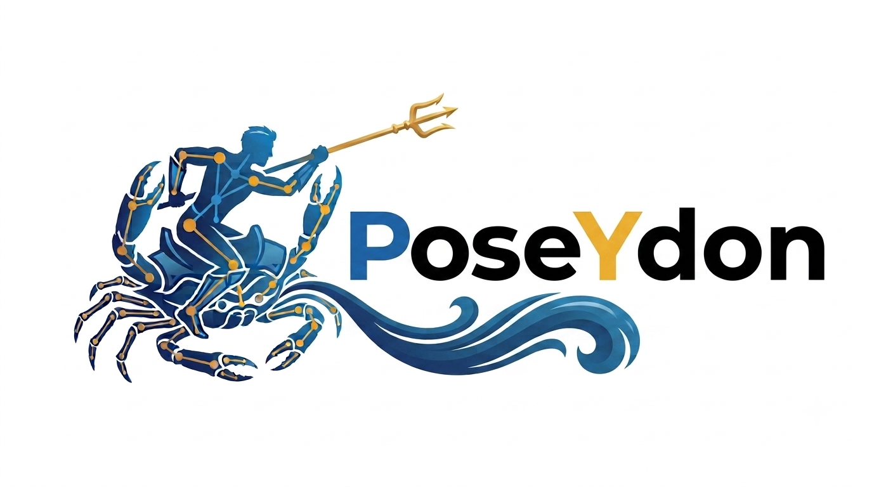

<p align="center">
  
</p>

<p align="center">
  <b>Research infrastructure for neural motion.</b><br>
  Generation, editing, in-betweening and cross-topology retargeting —
  one representation, one training loop, one set of contracts.
</p>

---

MDM is the cornerstone of this field and deserves to be. It is also five years of
accumulated assumptions: feature layout, joint counts, skeleton metadata, loss
composition and sampling behaviour are fixed in constants or inlined into forward
passes. Every new dataset is a fork, every ablation a patch, and every follow-up
reimplements the preprocessing slightly differently — differences that stay
invisible until the numbers disagree.

PoseYdon is a fresh starting point. It keeps what the lineage got right — the
diffusion formulation, the 13-dimensional per-joint representation, the
graph-attention backbone — and rebuilds the scaffolding so the interesting parts
are the parts you change:

```bash
poseydon train                                 # defaults
poseydon train process=flow                    # flow matching instead of diffusion
poseydon train features=[rot6d,local_vel]      # a different representation, no re-ingest
poseydon retarget --content Flamingo/onelegbent --target Scorpion
```

The process, the feature set, the model and the loss are separate objects the
config composes — not flags bolted onto a monolith.

## Verified against the work it builds on

A rewrite claiming faithfulness is worth nothing unless it is measured.
`external/neural_motion_blending/` is a read-only checkout of the published
implementation, and the parity tools drive **both** codebases from the same
weights and the same noise:

| | agreement |
|---|---|
| features, 7 rigs, every block | ~1e-6, foot contact **bit-exact** |
| DDPM sampling, 200 frames × 100 steps | **2.97e-06** relative |
| DDIM sampling, 200 frames × 100 steps | **8.39e-07** relative |

Where PoseYdon deliberately differs — invertible preparation, centred
per-channel normalization, a constant-channel guard — it is documented as a
choice with the measurement behind it.

## Start here

Docker is the only host requirement.

```bash
docker compose build test
docker compose run --rm test pytest
docker compose run --rm test python -m poseydon.cli list
```

| | |
|---|---|
| [Quick start](docs/guides/quickstart.md) | ingest a corpus, train, sample |
| [Architecture](docs/guides/architecture.md) | how the pieces fit, and why they are separate |
| [Sampling](docs/guides/sampling.md) | samplers, controls, and rebuilding a skeleton |
| [Retargeting](docs/guides/retargeting.md) | cross-topology transfer, and watching it during training |
| [Testing](docs/guides/testing.md) | what is covered, and how coverage is checked |
| [Documents](docs/README.md) | the specs and plans behind the design |

## Layout

```
src/poseydon/
├── core/          contracts: spec, batch, anim, skeleton, topology, rotations
├── io/            BVH read and write, rendering
├── ingest/        alignment, corpus index, pipeline
├── features/      extractors, assembly, recovery
├── conditioners/  topology, tpose, joint names, normalization statistics
├── data/          windowing, dataset, collate, normalization
├── models/        base, anytop, modiffae
├── process/       gaussian diffusion, flow matching
├── losses/        simple, geodesic, footskate, kl
├── solvers/       batched inverse kinematics
├── sampling/      samplers and step-level controls
├── ops/           generate, inbetween, blend, retarget
└── training/      task, Lightning wrappers, validation, config wiring
```

## Reference

`external/neural_motion_blending/` is a **read-only** checkout of the published
work this builds on, kept for parity checking. Never edit it.
